## 🛠️ Projet ENI 03 – Symfony – Site de gestion d'évènement

### 🚀 Technologies utilisées
- HTML  
- CSS  
- JavaScript  
- Php (Symfony)
- Mysql 

### 📝 Description

Ce projet est le **troisième réalisé en autonomie**, sur un peu moins de deux semaines, dans le cadre de ma formation à l'ENI.

L’objectif était de développer en partie, un site de gestion d'évènement entre stagiaires de formation.

### ✅ Fonctionnalités développées (toutes fonctionnelles avec persistance en base de données) :

- **Sécurité** - Les pages ne sont accessibles qu'aux membres (seuls les administrateurs peuvent créer des participants).
- **Fixtures**  - mise en place de la génération de fausses données réalistes.
- **Listing des sorties** créées et ouvertes à l'inscription.
- **Méthodes de tri** via des filtres (recherche dans le titre, campus (par défaut celui de l’utilisateur), dates, création et inscription).
- **Affichage des profils**
- **modification de son profil** (l'administrateur a également la possibilité de modifier tous les profils ).
- **Inscriptions aux sorties** (et désinscription si la sortie est encore ouverte).
- **Création / Modification des sorties** - modification possible jusqu’à la publication
-**Publication des sorties** avec vérifications supplémentaires aux contraintes de la BDD pour vérifier si la sortie est complète.
- **Annulation d’une sortie** par son créateur. Chaque annulation doit être justifiée par un motif.
- **Administration** - Les membres administrateurs peuvent gérer les utilisateurs, les campus et les lieux (création, modification, suppression pour tous ces éléments).
- **Création de scripts** pouvant être déclenchés par des tâches planifiées pour historiser les événements passés et les effacer après une certaine période.


### 🐞Difficultés rencontrées

- Anticipation
    Les fonctionnalités demandées par l'école sont sous forme de liste à implémenter dans l'ordre, il est donc parfois difficile de se projeter sur la souplesse à apporter aux éléments.

-Requêtes aux serveurs : Les méthodes de tri demandées par l’école étant complètement incohérentes les unes par rapport aux autres, il a été relativement compliqué de les implémenter…

- Persistance du cache
    J'ai rencontré à plusieurs reprises des difficultés causées par le cache de Symfony, les modifications n'étaient pas prises en compte ou seulement partiellement.

- Documentation Twig
      Autant la documentation Symfony est très complète et bien expliquée, autant celle de Twig (le moteur de template) est très succincte et les exemples toujours un peu particuliers.

### 👮 Securité
La sécurité repose sur la configuration de Symfony.
Le fichier security.yaml est configuré pour bloquer l’accès à toutes les routes, sauf à la page de connexion, pour les utilisateurs non authentifiés.

```yaml
    access_control:
        # Autoriser l'accès public uniquement à la page de login et logout
        - { path: ^/login, roles: PUBLIC_ACCESS }
        - { path: ^/logout, roles: PUBLIC_ACCESS }

        # Interdire tout le reste aux non-authentifiés
        - { path: ^/, roles: ROLE_USER }
```

Pour les autorisations de créations, modifications, éditions, visibilités, annulation, désistements,..., des sorties et des membres tout passe par des Voters ; Des classes qui gèrent l'accés selon les cas. Seul l'organsateur peut annuler une sortie à la condition que celle ci soit publiée par exemple.
Exemple d'un extrait du Voter de Sortie.

```php
protected function voteOnAttribute(string $attribute, mixed $subject, TokenInterface $token): bool
    {
        $user = $token->getUser();

        if (!$user instanceof UserInterface) {
            return false;
        }
        $sortie = $subject;

        switch ($attribute) {
            case self::EDIT:
                return $sortie->getOrganisateur() === $user
                    && $sortie->getEtat()->getCode() === Etat::CODE_EN_CREATION;

            case self::VIEW:
                return $sortie->getOrganisateur() === $user
                    || in_array($sortie->getEtat()->getCode(), [ Etat::CODE_OUVERTE,  Etat::CODE_EN_COURS, Etat::CODE_CLOTUREE, Etat::CODE_ANNULEE], true);

            case self::ENROLL:
                return
                    !in_array($user, $sortie->getParticipants()->toArray(), true)
                    && $sortie->getEtat()->getCode() === Etat::CODE_OUVERTE
                    && $sortie->getDateLimiteInscription() > new \DateTimeImmutable('now')
                    && count($sortie->getParticipants()) < $sortie->getNbInscriptionMax();

            case self::WITHDRAW:
                return in_array($user, $sortie->getParticipants()->toArray(), true)
                    && ($sortie->getEtat()->getCode() === Etat::CODE_OUVERTE
                    || $sortie->getEtat()->getCode() === Etat::CODE_CLOTUREE)
                    && $sortie->getEtat()->getCode() !== Etat::CODE_ANNULEE
                    && $sortie->getDateHeureDebut() > new \DateTimeImmutable('now');

            case self::CANCELABLE:
                return $sortie->getOrganisateur() === $user
                    && $sortie->getEtat()->getCode() === Etat::CODE_OUVERTE;
        }

        return false;
    }
```

Une simple ligne dans le controller suffit alors à donner l'accés ou pas

```php
$this->denyAccessUnlessGranted('SORTIE_EDIT', $sortie);
```

L'affichage est aussi grandement facilité.

```twig

    //ici le bouton qui n'appaitra que si l'utilisateur à le droit d'édition sur la sortie

```


### 🔍 Aperçu

#### 📐 Wireframes fournis (pas de maquettes graphiques)


#### 🔑 Login


#### 🏠 Page d'accueil


#### 📅 Détail d'une sortie


#### ❌ Désistement


#### ❌ Désistement depuis la page d'accueil (en cliquant sur le pictogramme 👤 qui signifie l'inscription aux sorties )


#### 🙍‍♂️ Détail d'un profil


#### 🙍‍♂️ Modification de son profil avec upload d'image


#### 🖼️ Détail profil modifié
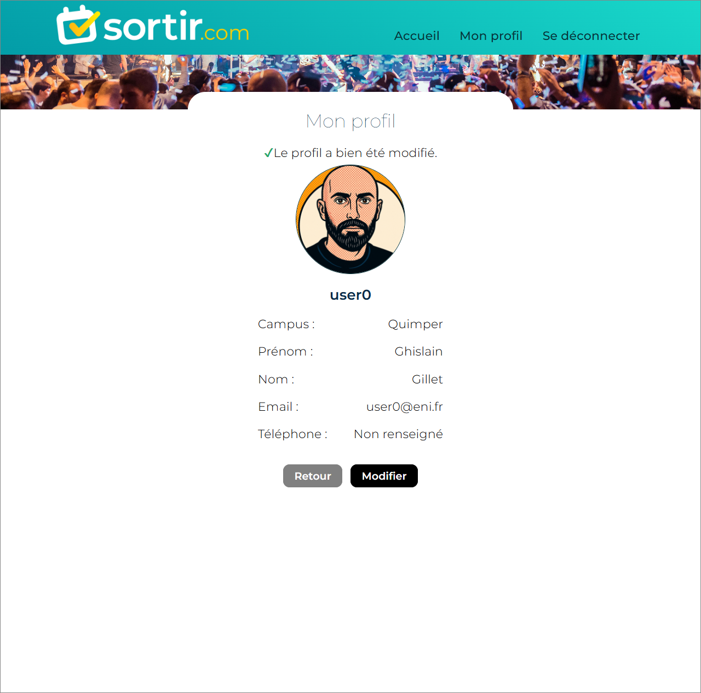

#### 🔍 Filtres


#### 🔍 Filtres (les sorties passées sont visuellement différentes)


#### ➕ RollOver création d'une sortie


#### ➕ Création d'une sortie


#### 🚩 Vérification d'une sortie (une sortie ne peut être publiée qu'à certaines conditions mais il est possible de l'enregistrer pour une publication utltérieure)
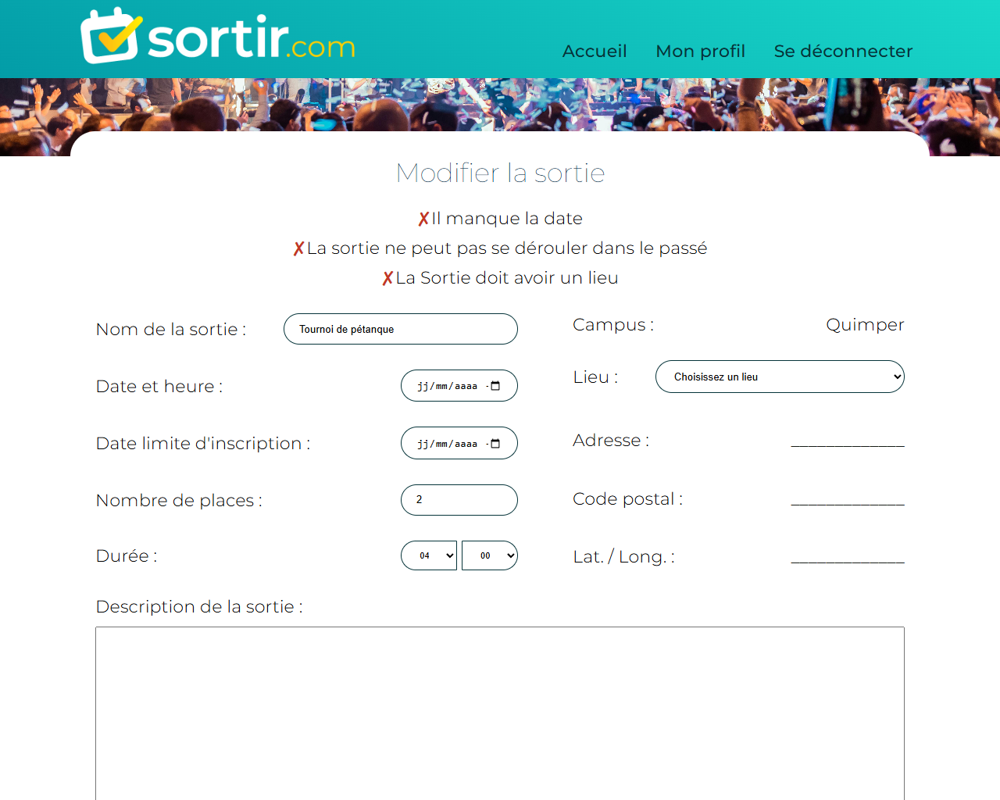

#### ➕ Création d'une sortie (complétée)


#### ✔️ Inscription à une sortie 


#### ❌ Annulation d'une sortie par son organisateur


#### 🚨 La sortie annulée est visuellement marquée dans la liste
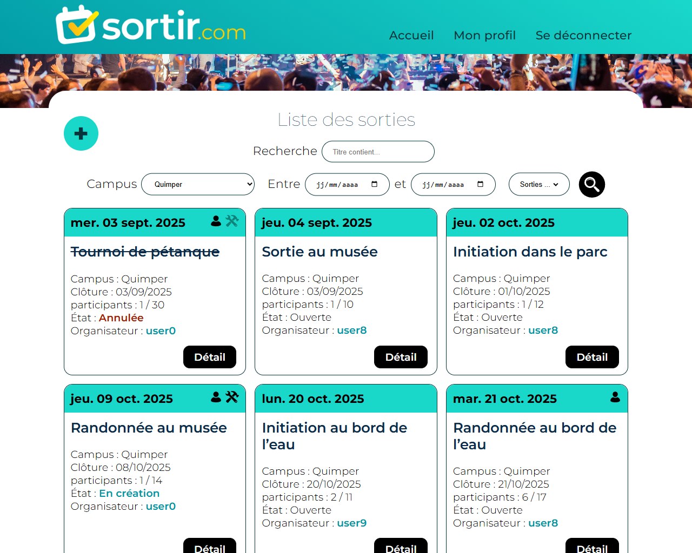

#### 🤖 Page admin
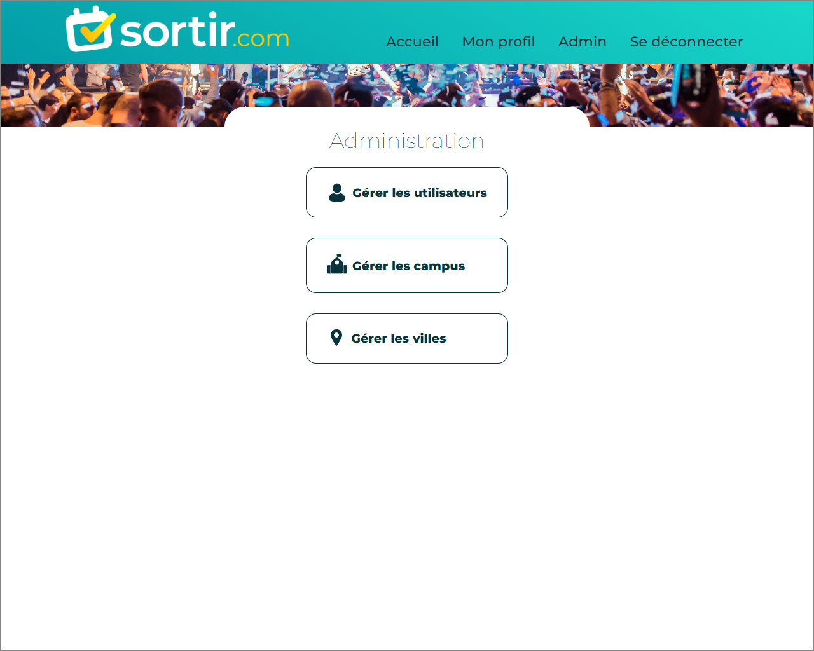

#### 👨‍👨 Admin utilisateurs
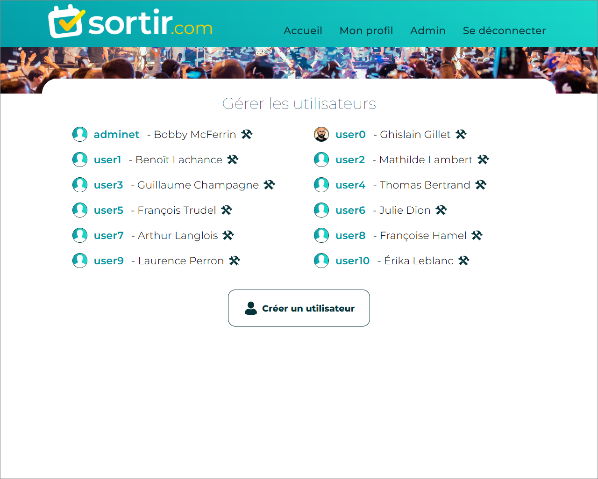

#### 🏛️ Admin campus
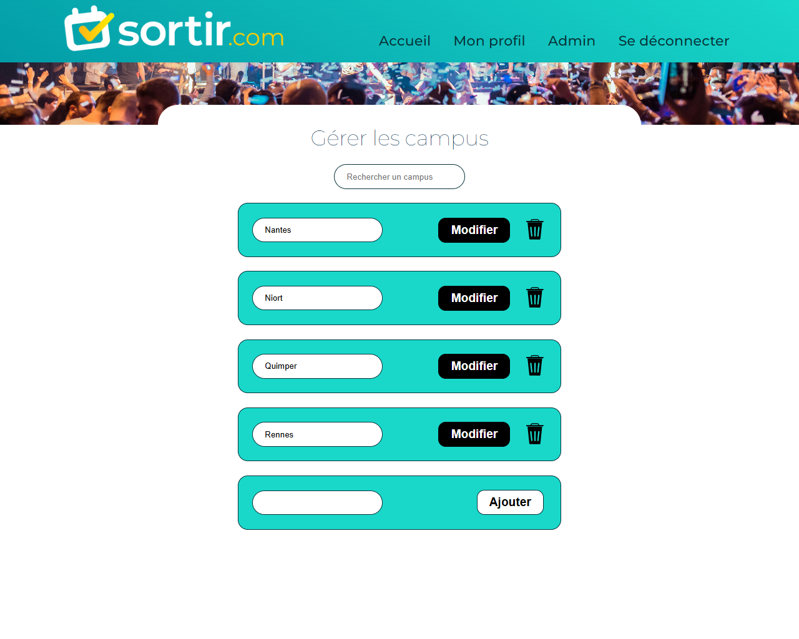

#### 🏛️ Admin campus (modification - les cahamps sont vérouillés par défaut)
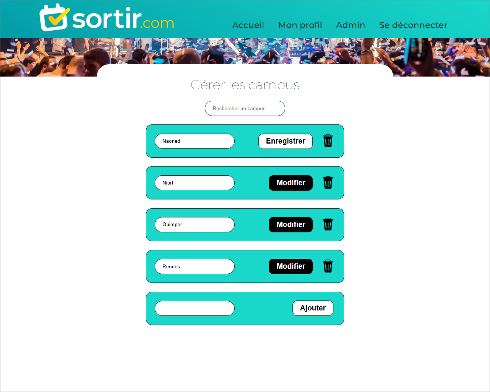

#### 🏙️ Admin villes
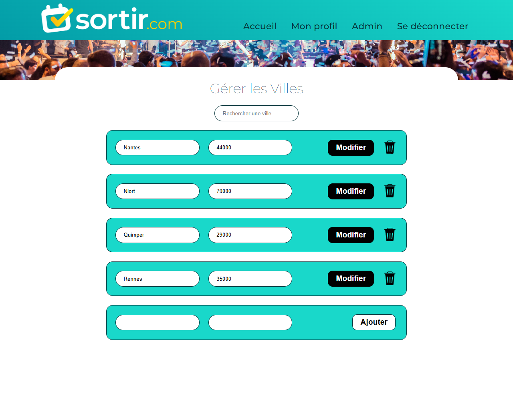

#### 🔎 Tri dynamique des villes
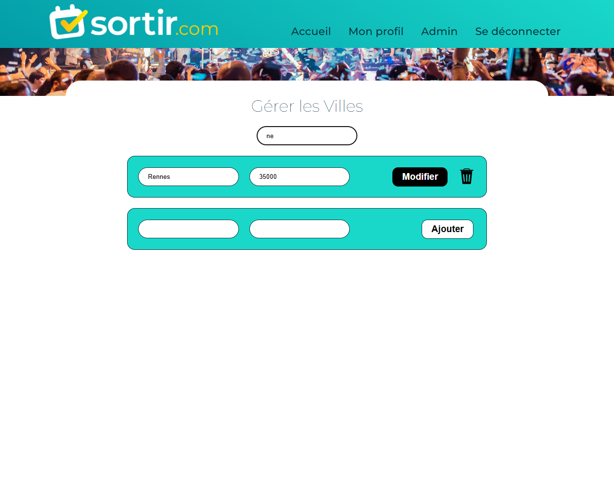

#### 📱 Le site est responsive
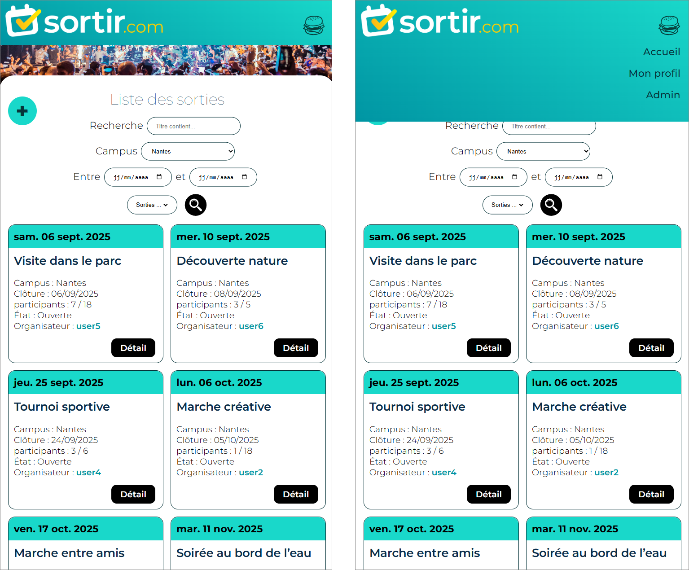

#### ⛔ Page 404 (page inexistante)


#### ⛔ Erreur 500 (erreur du serveur)
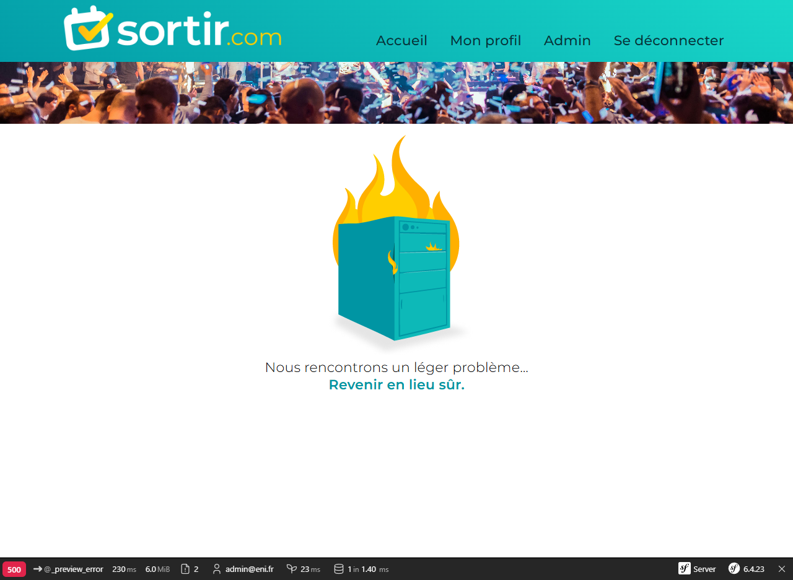

---

### 👨‍💻 Auteur  
**Ghislain Gillet** – Développeur Full Stack en reconversion  
🔗 [Mon profil LinkedIn](https://www.linkedin.com/in/ghislain-gillet44)


