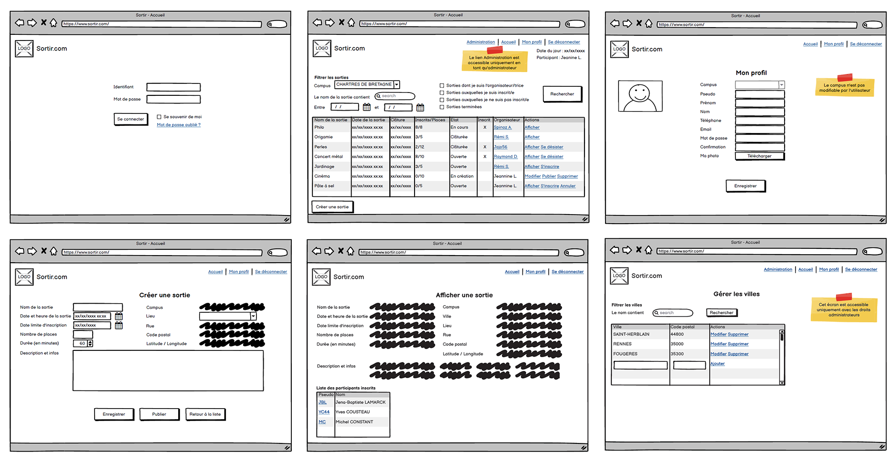
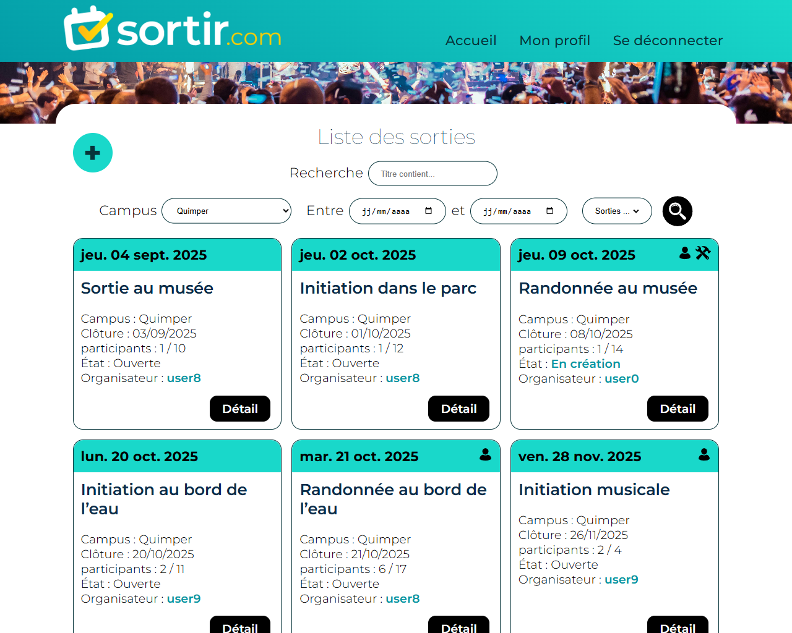
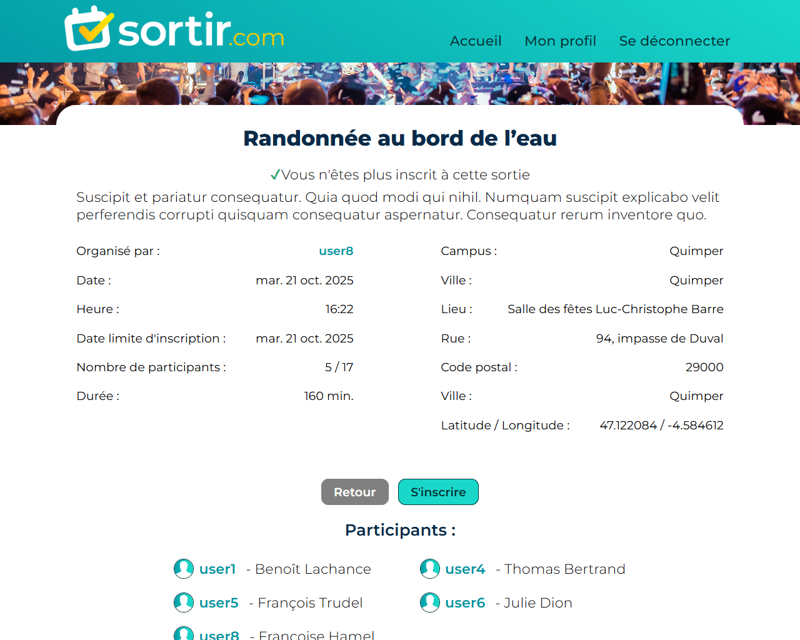
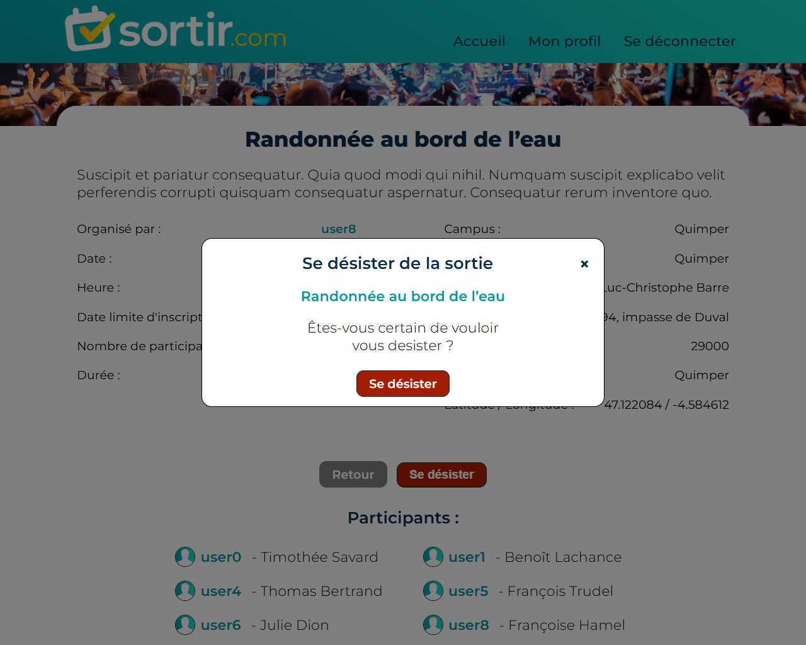
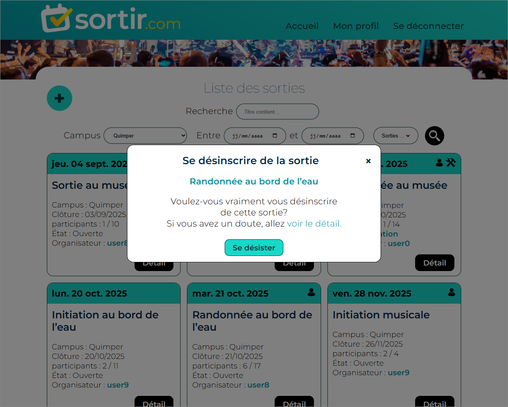
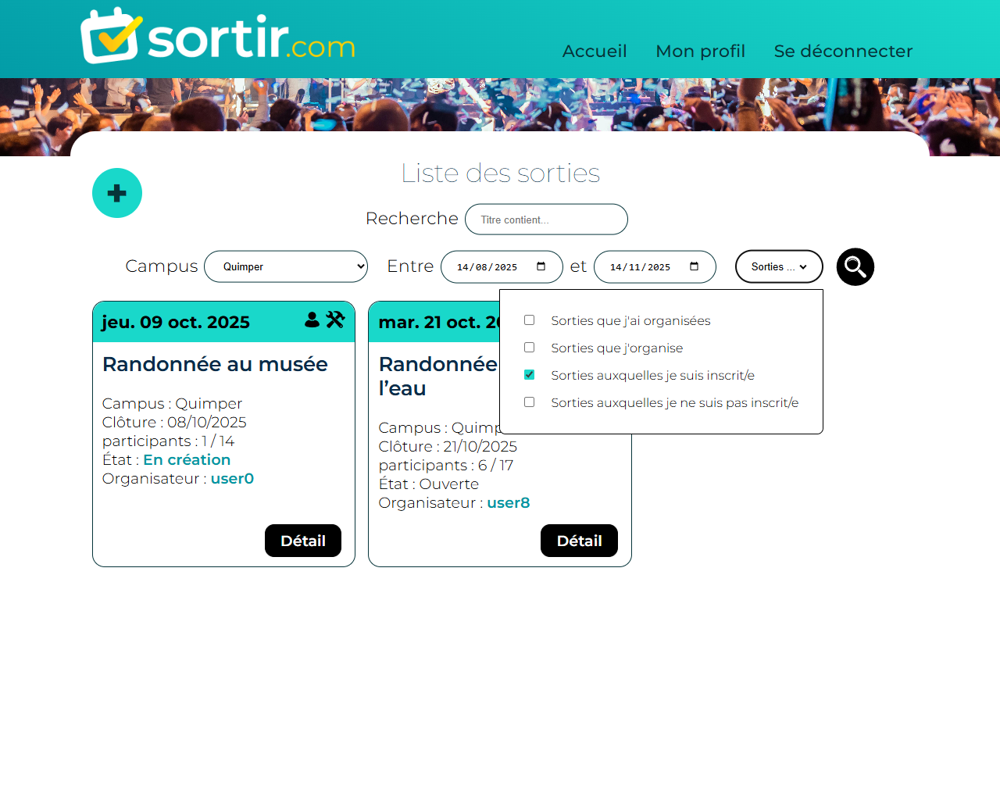
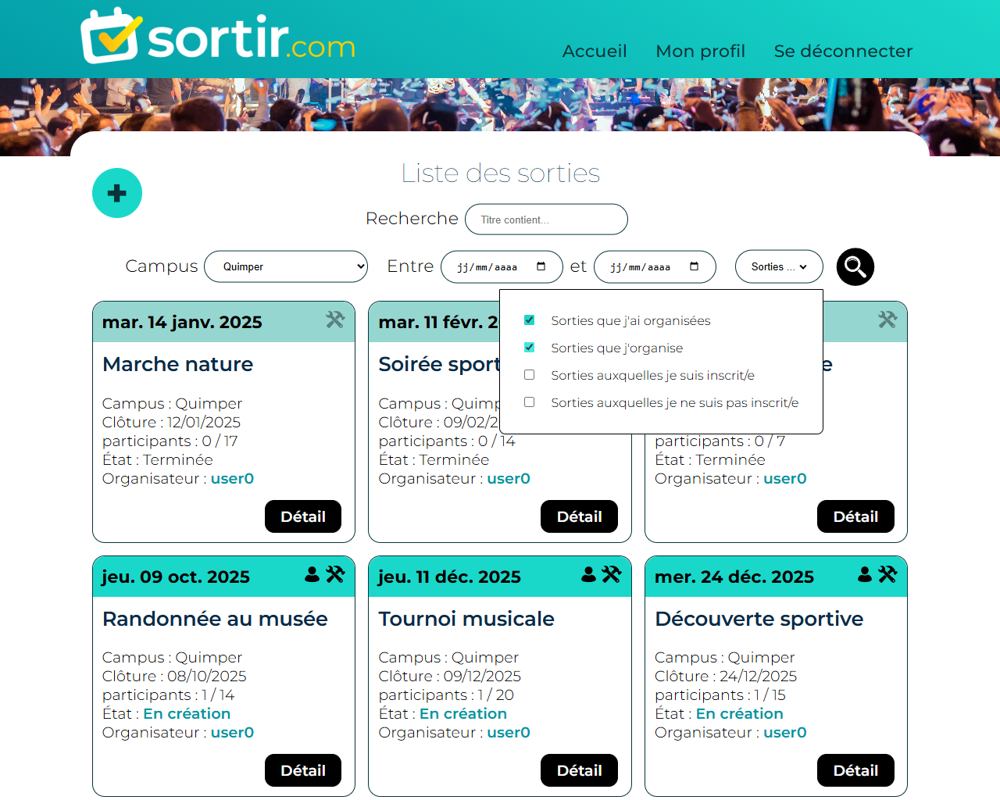
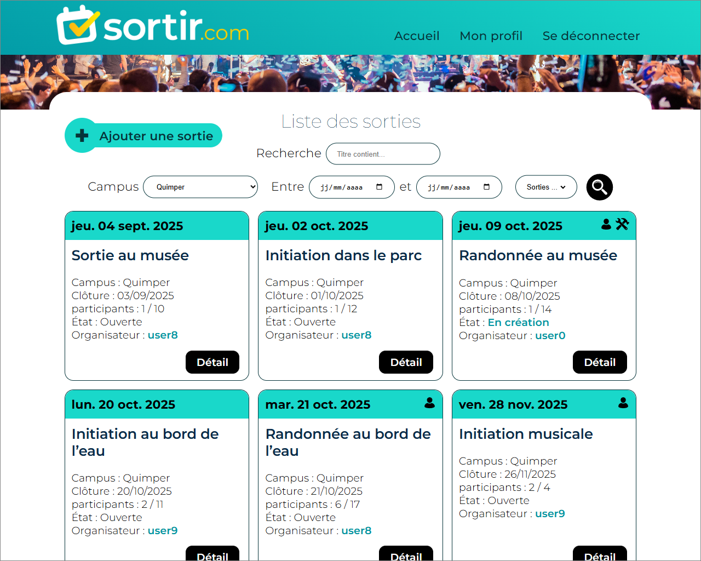
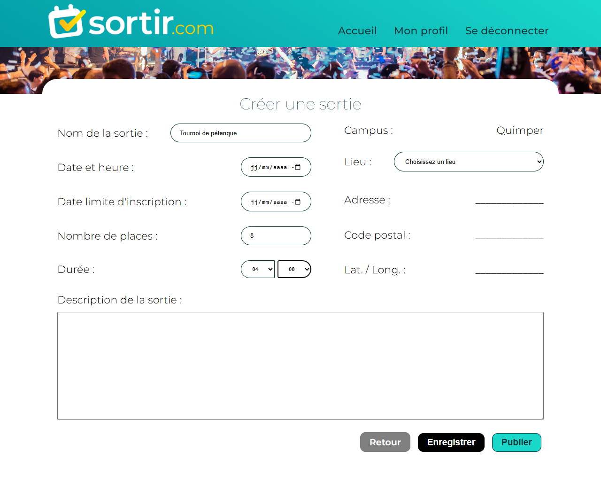
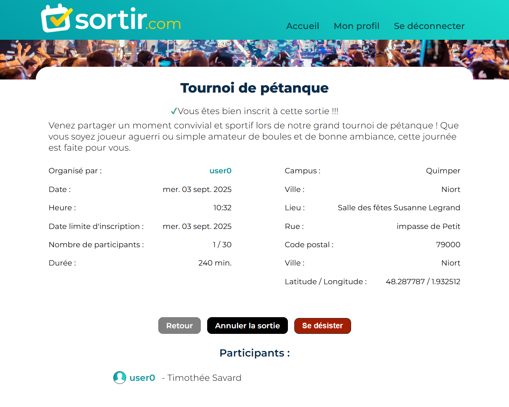

## 🛠️ Projet ENI 03 – Symfony – Site de gestion d'évènement

### 🚀 Technologies utilisées
- HTML  
- CSS  
- JavaScript  
- Php (Symfony)
- Mysql 

### 📝 Description

Ce projet est le **troisième réalisé en autonomie**, sur un peu moins de deux semaines, dans le cadre de ma formation à l'ENI.

L’objectif était de développer en partie, un site de gestion d'évènement entre stagiaires de formation.

### ✅ Fonctionnalités développées (toutes fonctionnelles avec persistance en base de données) :

- **Sécurité** - Les pages ne sont accessibles qu'aux membres (seuls les administrateurs peuvent créer des participants).
- **Fixtures**  - mise en place de la génération de fausses données réalistes.
- **Listing des sorties** créées et ouvertes à l'inscription.
- **Méthodes de tri** via des filtres (recherche dans le titre, campus (par défaut celui de l’utilisateur), dates, création et inscription).
- **Affichage des profils**
- **modification de son profil** (l'administrateur a également la possibilité de modifier tous les profils ).
- **Inscriptions aux sorties** (et désinscription si la sortie est encore ouverte).
- **Création / Modification des sorties** - modification possible jusqu’à la publication
-**Publication des sorties** avec vérifications supplémentaires aux contraintes de la BDD pour vérifier si la sortie est complète.
- **Annulation d’une sortie** par son créateur. Chaque annulation doit être justifiée par un motif.
- **Administration** - Les membres administrateurs peuvent gérer les utilisateurs, les campus et les lieux (création, modification, suppression pour tous ces éléments).
- **Création de scripts** pouvant être déclenchés par des tâches planifiées pour historiser les événements passés et les effacer après une certaine période.

### 🐞Difficultés rencontrées

- Anticipation
    Les fonctionnalités demandées par l'école sont sous forme de liste à implémenter dans l'ordre, il est donc parfois difficile de se projeter sur la souplesse à apporter aux éléments.

-Requêtes aux serveurs : Les méthodes de tri demandées par l’école étant complètement incohérentes les unes par rapport aux autres, il a été relativement compliqué de les implémenter…

- Persistance du cache
    J'ai rencontré à plusieurs reprises des difficultés causées par le cache de Symfony, les modifications n'étaient pas prises en compte ou seulement partiellement.

- Documentation Twig
      Autant la documentation Symfony est très complète et bien expliquée, autant celle de Twig (le moteur de template) est très succincte et les exemples toujours un peu particuliers.

### 🔍 Aperçu

#### 📐 Wireframes fournis (pas de maquettes graphiques)

#### 🔑 Login

#### 🏠 Page d'accueil

#### 📅 Détail d'une sortie

#### ❌ Désistement

#### ❌ Désistement depuis la page d'accueil (en cliquant sur le pictogramme 👤 qui signifie l'inscription aux sorties )

#### 🙍‍♂️ Détail d'un profil

#### 🔍 Filtres

#### 🔍 Filtres

#### ➕ RollOver création d'une sortie

#### ➕ Création d'une sortie

#### 🚩 Vérification d'une sortie (une sortie ne peut être publiée qu'à certaines conditions)

#### ➕ Création d'une sortie (complétée)

#### ✔️ Inscription à une sortie 

#### ❌ Vérification d'une sortie (une sortie ne peut être publiée qu'à certaines conditions)

